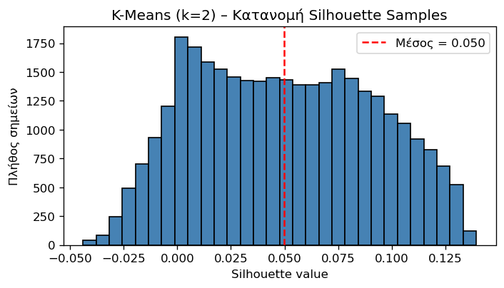
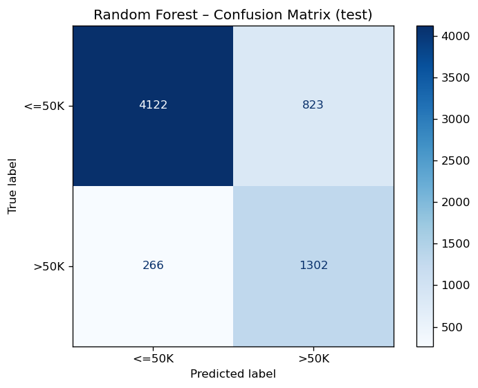
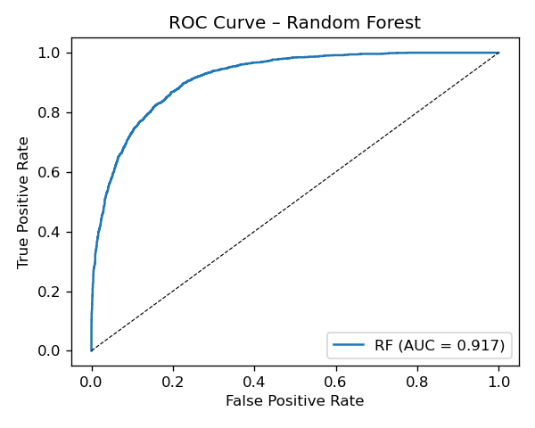
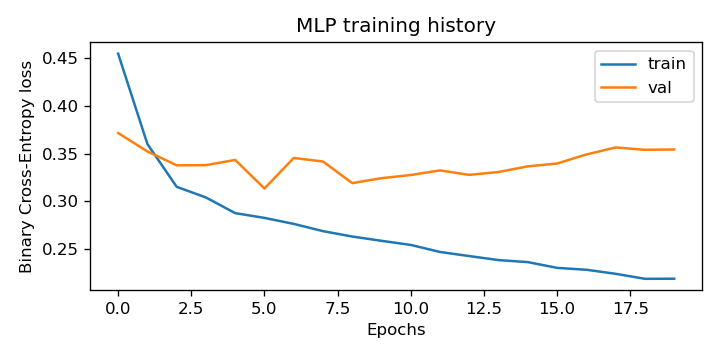

# Adult Income Feature Selection, Clustering, and Classification

This project presents a data mining workflow on the **UCI Adult Income dataset**. The goal is to analyze demographic and employment-related attributes and build models that predict whether a person's annual income is above or below `$50K`.

The notebook includes data preparation, feature engineering, feature selection, outlier analysis, clustering, classical machine-learning classification, and a neural-network classifier implemented with **PyTorch**.

This repository is prepared as a portfolio-style project. It documents the implemented workflow and results without claiming that every requirement from the original course assignment was implemented exactly as specified.

---

## Project Overview

The analysis covers the following stages:

- Data loading and initial exploration
- Missing-value inspection and preprocessing
- Normalization and discretization of numerical variables
- Feature selection using statistical and model-based methods
- Outlier detection and winsorization for `hours-per-week`
- Clustering with K-Means and Agglomerative Clustering
- Classification with Logistic Regression and Random Forest
- Neural-network classification with a PyTorch MLP
- Evaluation using accuracy, F1 score, ROC-AUC, ARI, NMI, and Silhouette score
- Visualization of clustering and classification results

---

## Repository Structure

```text
adult-income-feature-selection-clustering-classification/
│
├── README.md
├── requirements.txt
├── .gitignore
│
├── notebooks/
│   └── adult_income_feature_selection_clustering_classification.ipynb
│
├── figures/
│   ├── mlp_history.png
│   ├── rf_confusion.png
│   ├── roc_rf.png
│   └── silhouette_k2.png
│
└── data/
    └── README.md
```

The dataset files are not committed to the repository. The `data/README.md` file explains how to obtain and place the dataset locally.

---

## Dataset

The project uses the **Adult Income dataset** from the UCI Machine Learning Repository.

The dataset contains demographic and employment-related features such as:

- age
- workclass
- education
- marital status
- occupation
- relationship
- race
- sex
- capital gain
- capital loss
- hours per week
- native country
- income class

The target variable is whether income is:

```text
<=50K
>50K
```

To run the notebook, place the dataset file in:

```text
data/adult.data
```

The notebook expects the dataset to be accessible from the notebook folder using:

```python
../data/adult.data
```

---

## Methods

### 1. Data Preparation and Feature Engineering

The dataset is loaded with manually defined column names. The preprocessing workflow includes:

- inspecting missing values,
- encoding the income target,
- scaling numerical variables,
- discretizing age into age groups,
- preparing encoded datasets for downstream tasks.

### 2. Feature Selection and Outlier Treatment

Feature selection is used to identify the most informative predictors. The selected top features include variables such as:

- `age`
- `education-num`
- `capital-gain`
- `marital-status_Married-civ-spouse`
- `marital-status_Never-married`

A Decision Tree classifier is used to compare the effect of using all features versus only the selected top features.

Outlier detection is applied to the `hours-per-week` feature using the Interquartile Range (IQR) method. Instead of removing observations, winsorization is applied to reduce the influence of extreme values while preserving the full dataset.

### 3. Clustering

The clustering analysis excludes the income target during unsupervised learning and uses the true income labels only for external evaluation.

Implemented clustering methods:

- K-Means
- Agglomerative Clustering with Ward linkage

Evaluation metrics:

- Adjusted Rand Index (ARI)
- Normalized Mutual Information (NMI)
- Silhouette score

K-Means with `k = 2` achieved the highest agreement with the income labels among the tested clustering configurations, while Agglomerative Clustering produced more compact clusters according to the Silhouette score but weaker alignment with the actual income classes.

### 4. Classification with Scikit-Learn

The classification stage uses an 80/20 stratified train-test split and evaluates classical machine-learning models.

Implemented models:

- Logistic Regression
- Random Forest

Reported test-set performance:

| Model | Accuracy | F1 Score | ROC-AUC |
|---|---:|---:|---:|
| Logistic Regression | 0.816 | 0.692 | 0.912 |
| Random Forest | 0.833 | 0.705 | 0.917 |

The Random Forest model achieved the best overall performance among the tested scikit-learn classifiers.

### 5. Neural-Network Classification with PyTorch

A Multi-Layer Perceptron (MLP) is implemented using **PyTorch**. The neural-network experiment uses a train/validation/test split and evaluates the model using classification metrics.

The MLP architecture includes:

- input layer,
- hidden fully connected layers,
- output layer for binary classification.

Reported test-set performance:

| Metric | Value |
|---|---:|
| Test Accuracy | 0.842 |
| Test F1 Score | 0.652 |
| Test ROC-AUC | 0.895 |

The PyTorch MLP provides an additional neural-network baseline and allows comparison with the classical scikit-learn models.

---

## Representative Figures

### K-Means Silhouette Distribution

<p align="center">
  
</p>

### Random Forest Confusion Matrix

<p align="center">
  
</p>

### Random Forest ROC Curve

<p align="center">
  
</p>

### PyTorch MLP Training History

<p align="center">
  
</p>

---

## How to Run

### 1. Clone the repository

```bash
git clone https://github.com/Gerostathos/adult-income-feature-selection-clustering-classification.git
cd adult-income-feature-selection-clustering-classification
```

### 2. Create a virtual environment

```bash
python -m venv .venv
```

Activate it:

```bash
# Windows
.venv\Scripts\activate

# macOS / Linux
source .venv/bin/activate
```

### 3. Install dependencies

```bash
pip install -r requirements.txt
```

### 4. Add the dataset locally

Download the Adult Income dataset and place `adult.data` inside:

```text
data/
```

Expected path:

```text
data/adult.data
```

### 5. Run the notebook

```bash
jupyter notebook notebooks/adult_income_feature_selection_clustering_classification.ipynb
```

---

## Important Notes

- The notebook is written as an exploratory data mining workflow.
- The neural-network component is implemented in **PyTorch**.
- The dataset files are intentionally excluded from the repository and should be downloaded separately.
- The repository focuses on the implemented analysis and does not present itself as a complete reproduction of every requirement from the original course assignment.
- Some notebook cells may contain local development paths from the original working environment. When running the notebook on another machine, update those paths to use the repository-relative dataset path `../data/adult.data`.

---

## What This Project Demonstrates

This project demonstrates:

- tabular data preprocessing,
- feature engineering,
- feature selection,
- outlier detection and treatment,
- clustering evaluation,
- supervised classification,
- model comparison,
- neural-network modelling with PyTorch,
- metric-based evaluation,
- visualization of model results,
- preparation of a clean notebook-based machine-learning project for GitHub.

---

## Future Improvements

- Add support for both `adult.data` and `adult.test`.
- Refactor preprocessing and modelling code into reusable Python modules.
- Add a configuration file for dataset paths and experiment settings.
- Expand hyperparameter tuning for Random Forest and the PyTorch MLP.
- Add automated metric export to CSV.
- Add a lightweight inference script for predicting income class on new samples.
